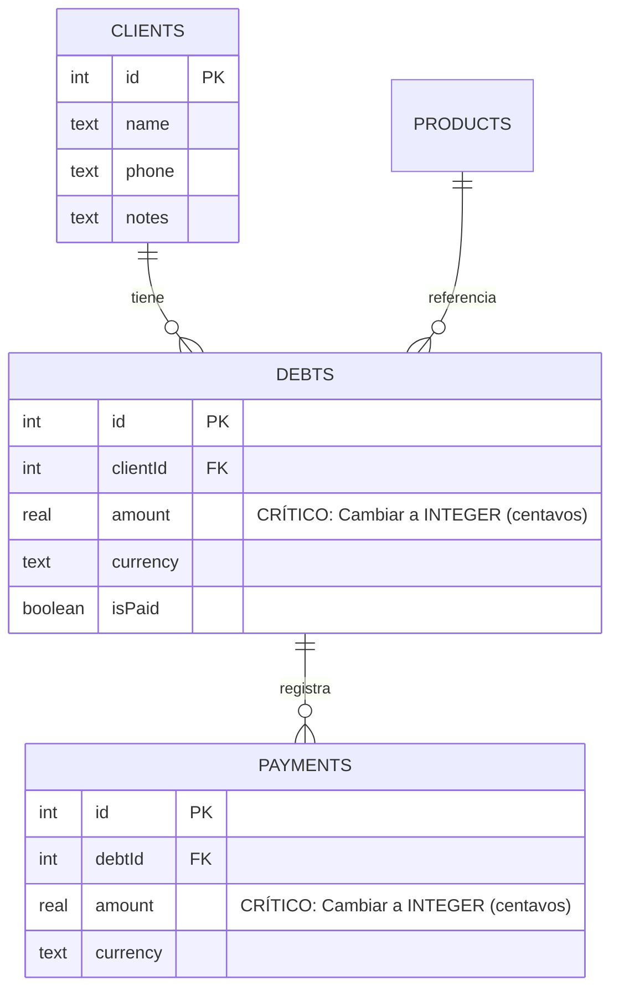

# Auditoría Técnica Exhaustiva de Código y Arquitectura: Project "CuentasClaras"

**Fecha de Evaluación:** 20 de Julio de 2026  
**Auditor Principal:** Principal Software Engineer, Security Engineer & DevSecOps Lead  
**Estado de Revisión:** RECHAZADO PARA PRODUCCIÓN (NOT PRODUCTION READY)  

---

## 1. Resumen Ejecutivo

Se ha llevado a cabo una auditoría técnica completa y rigurosa sobre el repositorio **CuentasClaras**, un sistema móvil offline-first orientado a la gestión de créditos y fiados para comerciantes en Latinoamérica.

El proyecto demuestra decisiones tecnológicas iniciales acertadas para su concepto de negocio (elección de Flutter, Riverpod para gestión de estado local y Drift/SQLite para persistencia embebida). No obstante, el sistema presenta **fallas críticas de diseño financiero, vulnerabilidades de seguridad de nivel de release, patrones anti-arquitectura en Flutter/Riverpod y ausencia de estándares DevOps mínimos** que impiden categóricamente su despliegue a producción.

---

## 2. Identificación del Stack Tecnológico

* **Framework Principal:** Flutter SDK `^3.12.2` (Dart)
* **Gestión de Estado & Inyección de Dependencias:** Flutter Riverpod (`flutter_riverpod: ^2.6.1`, `riverpod_annotation: ^2.6.1`)
* **Motor de Base de Datos Local:** Drift / SQLite (`drift: ^2.22.1`, `sqlite3_flutter_libs: ^0.5.28`, `path_provider: ^2.1.5`)
* **Enrutamiento y Navegación:** GoRouter (`go_router: ^14.8.1`)
* **Seguridad & Credenciales:** Flutter Secure Storage (`flutter_secure_storage: ^9.2.4`)
* **Analítica & Telemetría:** Firebase Core (`firebase_core: ^3.12.0`), Firebase Analytics (`firebase_analytics: ^11.4.3`)
* **Linter & Análisis Estático:** Flutter Lints (`flutter_lints: ^6.0.0`)
* **Target OS Primario:** Android (Gradle Kotlin DSL)

---

## 3. Tipo de Proyecto

**Aplicación Móvil Standalone / Offline-First Financial Ledger (Libro contable y gestión de cobros).**

---

## 4. Calificación General (0–100)

### **Puntuación Global: 58 / 100**

* **Arquitectura & Estructura (65/100):** Estructura modular limpia por features, pero con anti-patrones severos de reactividad y creación de proveedores inline en el árbol de Widgets.
* **Calidad de Código (60/100):** Código legible y formateado, pero con lints activos no corregidos (`use_build_context_synchronously`), desbordamientos de conversión de tipos no protegidos y bugs de UI state en formulación de deudas.
* **Seguridad (40/100):** Ausencia de hashing en credenciales sensibles (PIN en texto plano en SecureStorage), APK firmado con llaves de depuración en Release, backups de Android no restringidos (`android:allowBackup`) y API Keys en el repositorio.
* **Base de Datos & Finanzas (45/100):** Uso imperdonable de tipos de datos de punto flotante (`REAL`/`double`) para representar monedas y contabilidad financiera. Ausencia de índices en llaves foráneas y búsquedas recurrentes.
* **Rendimiento (70/100):** Consultas directas aceptables, pero con riesgos de fugas de memoria por instanciación de Streams en `build()` y escaneo completo de tablas por falta de índices.
* **Testing & Calidad (35/100):** Solo 10 pruebas unitarias para utilidades básicas y base de datos básica. Cobertura del 0% en Widgets, Pantallas, Flujos de Negocio e Integración.
* **DevOps & Producción (20/100):** Ausencia de CI/CD, binarios de 60MB commiteados en el repositorio de código, Proguard/R8 deshabilitado.

---

## 5. Estado de Preparación para Producción

🔴 **RECHAZADO (NO APTO PARA PRODUCCIÓN)**

El proyecto **NO reúne los requisitos mínimos de seguridad, integridad financiera ni empaquetado para ser liberado a usuarios reales.** En su estado actual, causará discrepancias financieras debido a errores de redondeo IEEE 754, fugas de credenciales en tiendas alternativas y cuelgues involuntarios ante parámetros malformados.

---

## 6. Fortalezas Reales Detectadas

1. ✅ **Selección de Stack Adecuada al Contexto:** El uso de Drift (SQLite) con Riverpod es la arquitectura idónea para una aplicación móvil offline-first sin servidor en LATAM.
2. ✅ **Patrón DAO y Transacciones:** Correcto aislamiento de operaciones de base de datos dentro de clases Data Access Object (`ClientsDao`, `DebtsDao`, `PaymentsDao`, `ProductsDao`), utilizando bloques de transacción ACID para operaciones compuestas como la eliminación de deudas y recalculo de pagos.
3. ✅ **Uso de GoRouter Declarativo:** Centralización de la configuración de rutas mediante `AppRouter` con soporte para `ShellRoute` y barra de navegación persistente.
4. ✅ **Modularización Limpia por Características:** Organización clara de carpetas bajo `lib/core`, `lib/data`, `lib/features` y `lib/shared`.

---

## 7. Hallazgos Críticos 🔴

### 7.1. Representación de Montos Financieros con Tipos de Punto Flotante (`REAL` / `double`)
* **Severidad:** 🔴 Crítico
* **Evidencia:**  
  - [debts_table.dart:L12](file:///c:/Users/Usuario/Desktop/Proyectos/CuentasClaras/lib/data/database/tables/debts_table.dart#L12): `RealColumn get amount => real()();`
  - [payments_table.dart:L11](file:///c:/Users/Usuario/Desktop/Proyectos/CuentasClaras/lib/data/database/tables/payments_table.dart#L11): `RealColumn get amount => real()();`
  - [products_table.dart:L10](file:///c:/Users/Usuario/Desktop/Proyectos/CuentasClaras/lib/data/database/tables/products_table.dart#L10): `RealColumn get defaultPrice => real()();`
  - [payments_dao.dart:L61](file:///c:/Users/Usuario/Desktop/Proyectos/CuentasClaras/lib/data/database/daos/payments_dao.dart#L61): `if (totalPaid >= debt.amount)`
* **Explicación Técnica:** Los tipos de datos de punto flotante de 64 bits (`double` / SQLite `REAL`) utilizan representación binaria IEEE 754, la cual no puede representar con precisión fracciones decimales en base 10 (ejemplo: `0.1 + 0.2` evalúa a `0.30000000000000004`). Al acumular pagos en `PaymentsDao` o comparar `totalPaid >= debt.amount`, un cliente que abone exactamente la suma requerida puede quedar marcado como "no pagado" si la suma flotante arroja `99.99999999999999 < 100.00`.
* **Riesgo:** Pérdida de integridad contable, registros erróneos de deudas impagadas y desconfianza inmediata del comerciante en el saldo.
* **Impacto:** Fallo funcional primario del sistema contable.
* **Recomendación:** Modificar el esquema de base de datos para almacenar importes monetarios como enteros (`IntColumn`) expresados en la menor unidad de la moneda (centavos/céntimos), o como cadenas de texto con precisión fija decimal de 4 dígitos.

### 7.2. Firma de Compilación Release con Llaves de Depuración (Debug Key)
* **Severidad:** 🔴 Crítico
* **Evidencia:**  
  - [build.gradle.kts:L33](file:///c:/Users/Usuario/Desktop/Proyectos/CuentasClaras/android/app/build.gradle.kts#L33):  
    ```kotlin
    buildTypes {
        release {
            signingConfig = signingConfigs.getByName("debug")
        }
    }
    ```
* **Explicación Técnica:** La configuración de Gradle asigna el keystore público de depuración (`debug.keystore`) para las compilaciones en modo Release.
* **Riesgo:** Cualquier atacante o tercero puede recompilar el APK de la aplicación, suplantar la firma del paquete y distribuir actualizaciones maliciosas que sobrescriban la instalación del usuario sin que el sistema operativo Android detecte violaciones de firma.
* **Impacto:** Compromiso total de la seguridad de distribución y riesgo de malware.
* **Recomendación:** Configurar un `release.keystore` privado cargado desde variables de entorno o `key.properties` (excluido de Git) e implementar firmamiento seguro en el proceso de build.

### 7.3. Almacenamiento de PIN de Usuario en Texto Plano
* **Severidad:** 🔴 Crítico
* **Evidencia:**  
  - [settings_provider.dart:L76-L77](file:///c:/Users/Usuario/Desktop/Proyectos/CuentasClaras/lib/shared/providers/settings_provider.dart#L76-L77):  
    ```dart
    Future<void> setPin(String pin) async {
      await _storage.write(key: AppConstants.pinStorageKey, value: pin);
      await setPinEnabled(true);
    }
    ```
* **Explicación Técnica:** Aunque `FlutterSecureStorage` encripta el almacén de claves en reposo (Keystore/Keychain), escribir el PIN de acceso directamente en texto plano sin aplicar una función de derivación de claves o hash salteado viola las directrices de seguridad de credenciales (OWASP Mobile M2/M4). Si un atacante o vulnerabilidad local logra dumpear el Keystore, obtendrá el PIN original.
* **Riesgo:** Extracción directa del PIN de acceso en dispositivos desprotegidos o mediante exploits de respaldo local.
* **Impacto:** Vulnerabilidad de autenticación y derivación de control de acceso.
* **Recomendación:** Aplicar un algoritmo de hashing seguro con sal (ej. Argon2id o SHA-256 salteado con UUID de instalación) antes de almacenar el PIN en `FlutterSecureStorage`.

---

## 8. Hallazgos Altos 🟠

### 8.1. Anti-patrón de Instanciación Inline de Proveedores Riverpod en `build()`
* **Severidad:** 🟠 Alto
* **Evidencia:**  
  - [client_detail_screen.dart:L22-L29](file:///c:/Users/Usuario/Desktop/Proyectos/CuentasClaras/lib/features/clients/client_detail_screen.dart#L22-L29):  
    ```dart
    final clientFuture = ref.watch(
      FutureProvider((ref) =>
          ref.watch(clientsDaoProvider).getClientById(clientId)),
    );
    final debtsStream = ref.watch(
      StreamProvider((ref) =>
          ref.watch(debtsDaoProvider).watchDebtsByClient(clientId)),
    );
    ```
* **Explicación Técnica:** En Riverpod, declarar `FutureProvider((ref) ...)` o `StreamProvider((ref) ...)` inline dentro de la función `build` de un Widget crea una **nueva instancia de proveedor en cada redibujado**. Esto reinicia las subscripciones a la base de datos, cancela futuros pendientes, causa fugas de listeners y provoca parpadeos de la UI en re-renders.
* **Riesgo:** Degradación del rendimiento, consumo excesivo de batería/CPU y comportamiento errático de la UI al escribir o actualizar la pantalla.
* **Impacto:** Inestabilidad de rendimiento y degradación de experiencia de usuario.
* **Recomendación:** Declarar los proveedores con la directiva `.family` fuera del árbol de Widgets a nivel de archivo/módulo global.

### 8.2. Restablecimiento de Moneda Seleccionada durante Re-renders de Formulario
* **Severidad:** 🟠 Alto
* **Evidencia:**  
  - [register_debt_screen.dart:L65-L66](file:///c:/Users/Usuario/Desktop/Proyectos/CuentasClaras/lib/features/debts/register_debt_screen.dart#L65-L66):  
    ```dart
    final settings = ref.watch(settingsProvider);
    _selectedCurrency = settings.defaultCurrency;
    ```
* **Explicación Técnica:** La variable de estado de la pantalla `_selectedCurrency` se sobrescribe incondicionalmente dentro del método `build()` en cada renderizado de la pantalla. Si el usuario selecciona manualmente una moneda diferente (ej. `VES`) y la pantalla se redibuja (por ejemplo, al abrir el teclado o validar un campo), `_selectedCurrency` se reiniciará a la moneda por defecto (`USD`).
* **Riesgo:** El comerciante puede registrar un fiado en la moneda equivocada sin advertirlo si cambió el desplegable antes de enviar el formulario.
* **Impacto:** Error de entrada de datos financieros.
* **Recomendación:** Mover la inicialización de `_selectedCurrency` al método `initState()` o a un listener de cambio inicial único.

### 8.3. Binarios APK y Artefactos de Build Commiteados en el Repositorio de Git
* **Severidad:** 🟠 Alto
* **Evidencia:**  
  - Archivo `docs/cuentas-claras.apk` (60.9 MB)  
  - Archivo `landing/cuentas-claras.apk` (60.9 MB)  
* **Explicación Técnica:** Se han subido al control de versiones binarios APK que suman más de 120 MB en el árbol de Git. Esto contamina el historial del repositorio, ralentiza los tiempos de clonación/checkout y expone versiones compiladas no auditadas.
* **Riesgo:** Inflado inútil del repositorio de Git y exposición de binarios desactualizados sin versionado claro.
* **Impacto:** Mala práctica DevOps severa y deterioro de la mantenibilidad del código fuente.
* **Recomendación:** Eliminar los binarios `.apk` de las carpetas `docs` y `landing`, agregarlos a `.gitignore` y distribuir binarios únicamente a través de GitHub Releases o hosting de artefactos dedicado.

---

## 9. Hallazgos Medios 🟡

### 9.1. Ingesta No Protegida de Parámetros de Ruta en Enrutamiento (`int.parse`)
* **Severidad:** 🟡 Medio
* **Evidencia:**  
  - [app_router.dart:L74](file:///c:/Users/Usuario/Desktop/Proyectos/CuentasClaras/lib/core/router/app_router.dart#L74): `final id = int.parse(state.pathParameters['id']!);`
* **Explicación Técnica:** El router intenta convertir el parámetro de ruta `:id` directamente con `int.parse` sin captura de excepciones. Si un deep link malicioso o una navegación errónea llama a `/clients/abc`, el método lanzará un `FormatException` sin manejar que provocará un cierre inesperado de la aplicación (Crash).
* **Recomendación:** Utilizar `int.tryParse()` y redirigir a una pantalla de error 404 o fallback si el ID no es numérico.

### 9.2. Advertencias del Linter por Uso Inseguro de `BuildContext` a través de Gaps Asíncronos
* **Severidad:** 🟡 Medio
* **Evidencia:**  
  - `clients_screen.dart:L226`  
  - `export_screen.dart:L135, L144, L204, L213, L233, L268`  
* **Explicación Técnica:** El código invoca `ScaffoldMessenger.of(context)` tras llamadas a métodos asíncronos (`await dao.insertClient(...)` o `await file.writeAsString(...)`), verificando únicamente `mounted` del estado en lugar de `context.mounted` recomendado por Flutter Dart SDK modernizado.
* **Recomendación:** Reemplazar las verificaciones con `if (!context.mounted) return;` antes de utilizar `context`.

---

## 10. Hallazgos Bajos 🟢

### 10.1. Convención de Nombres e Identificadores en Linter
* **Severidad:** 🟢 Bajo
* **Evidencia:**  
  - `client_detail_screen.dart:L36:22` (Uso innecesario de múltiples guiones bajos `__`)  
  - `home_screen.dart:L68:38` (Uso innecesario de múltiples guiones bajos `__`)  
* **Recomendación:** Corregir el nombrador de variables descartables a un único guión bajo `_`.

### 10.2. Documentación Incompleta en README.md
* **Severidad:** 🟢 Bajo
* **Evidencia:** `README.md` contiene 4 líneas con la plantilla por defecto de Flutter ("A new Flutter project.").
* **Recomendación:** Agregar instrucciones de instalación, prerequisitos de compilación (Dart SDK version, codegen comandos `build_runner`), arquitectura del proyecto y guías de desarrollo.

---

## 11. Revisión de Arquitectura

El diseño general sigue una arquitectura por capas orientada a características (**Feature-First Architecture**):

```
lib/
├── core/         # Constantes, router, temas, utilidades
├── data/         # Esquema de Drift, tablas SQLite, DAOs
├── features/     # Modulos (clients, debts, home, products, reports, settings)
└── shared/       # Proveedores globales de Riverpod, widgets compartidos
```

### Evaluaciones Específicas:
* **SOLID / DRY / KISS:** El desacoplamiento entre UI y persistencia a través de DAOs es adecuado. Sin embargo, la lógica de presentación (UI) mezcla la invocación directa de operaciones de base de datos (`ref.read(clientsDaoProvider).insertClient(...)`) dentro de los mismos Widgets sin pasar por Notifiers / Use Cases dedicados.
* **Manejo de Estado:** El uso de Riverpod es correcto en los proveedores compartidos (`databaseProvider`, `settingsProvider`), pero la violaciones inline en `ClientDetailScreen` rompen la inmutabilidad y estabilidad del flujo reactivo.

---

## 12. Revisión de Calidad del Código

* **Complejidad Ciclomática:** Baja y aceptable en vistas.
* **Clean Code:** Los widgets están subdivididos en componentes pequeños (`_ClientCard`, `SummaryCard`, `QuickActions`).
* **Bugs de Lógica:** Como se detalló en el hallazgo 8.2, el formulario de registro de deudas reinicia la moneda seleccionada durante re-renders.

---

## 13. Revisión de Seguridad (OWASP Mobile)

| Categoría OWASP Mobile | Estado | Evaluación |
| :--- | :---: | :--- |
| **M1: Improper Credential Usage** | 🔴 FALLO | PIN de seguridad almacenado en texto plano en `FlutterSecureStorage`. |
| **M2: Insecure Data Storage** | 🟠 RIESGO | Base de datos SQLite local desprotegida por falta de `android:allowBackup="false"`. |
| **M5: Insecure Communication** | 🟢 OK | Operación puramente local / offline-first. |
| **M8: Security Code Analysis** | 🔴 FALLO | APK compilado en Release firmado con credenciales de depuración (`debug.keystore`). |
| **M9: Reverse Engineering** | 🟠 RIESGO | ProGuard / R8 deobfuscation no configurado en `build.gradle.kts`. |

---

## 14. Revisión de Rendimiento

1. **Escaneo de Base de Datos:** Drift realiza lecturas reactivas fluidas. No obstante, las tablas `Debts` y `Payments` carecen de índices explícitos en `client_id` y `debt_id`. En conjuntos de datos superiores a 5,000 registros, el filtrado causará lag en el hilo principal.
2. **Re-renders en Flutter:** La instanciación de Streams en `build()` fuerza la re-suscripción continua al StreamController de SQLite.

---

## 15. Revisión de Dependencias

Las librerías seleccionadas en `pubspec.yaml` corresponden a versiones estables y modernas del ecosistema Flutter:
* `flutter_riverpod: ^2.6.1`
* `drift: ^2.22.1`
* `go_router: ^14.8.1`

No se identificaron dependencias en desuso ni conflictos de resolución de paquetes.

---

## 16. Revisión de Base de Datos (Drift / SQLite)

### Análisis del Esquema:


* **Defectos de Integridad:**  
  1. Falta de definición de índices compuestos en `(clientId, isPaid)` para acelerar consultas de deudas pendientes.
  2. Uso de `REAL` en lugar de `INTEGER` para representaciones monetarias.

---

## 17. Revisión de APIs

No aplica directamente por tratarse de una arquitectura **Offline-First**. No se detectan endpoints REST / GraphQL consumidos directamente en esta versión.

---

## 18. Revisión de UI / UX

* **Diseño Visual:** Excelente adopción del sistema de diseño (Material 3), paleta de colores coherente (`AppColors`), soporte de modo oscuro/claro y componentes limpios de estado vacío (`EmptyState`) e indicadores de carga.
* **Ergonomía:** Flujo optimizado para registro de deudas en menos de 3 toques.

---

## 19. Revisión de Testing

* **Pruebas Existentes:** Se detectaron únicamente 3 archivos de prueba unitaria en `test/unit/`:
  - `validators_test.dart` (4 pruebas)
  - `database_test.dart` (2 pruebas)
  - `currency_utils_test.dart` (4 pruebas)
* **Puntos Ciegos:**
  - 0% pruebas de Widgets / UI.
  - 0% pruebas de Notifiers de estado.
  - 0% pruebas de simulación de navegación con GoRouter.

---

## 20. Revisión de DevOps

* **CI/CD:** Inexistente (No se encontraron workflows de GitHub Actions o scripts de Fastlane).
* **Gestión de Artefactos:** Presencia de binarios APK commiteados en el árbol de código fuente.
* **Configuración Gradle:** Desoptimizado. Falta activación de `isMinifyEnabled = true` e `isShrinkResources = true`.

---

## 21. Revisión de Configuración

* `analysis_options.yaml` activo con `package:flutter_lints/flutter.yaml`.
* Presencia de `google-services.json` con API Keys de Firebase expuestas en el repositorio.

---

## 22. Revisión de Documentación

* `README.md`: Deficiente.
* `Plan_MVP_Costo_Cero_CuentasClaras.md`: Excelente documento estratégico conceptual y de negocio, pero no describe la instalación ni mantenimiento técnico del código.

---

## 23. Deuda Técnica Identificada

1. Migración del tipo de dato `REAL` a `INT` (centavos) en la base de datos de Drift.
2. Refactorización de proveedores inline de Riverpod a `.family`.
3. Implementación de Hashing (SHA-256 + Salt) para la autenticación por PIN.
4. Limpieza del historial de Git para purgar los archivos `.apk` de 120MB.

---

## 24. Archivos que Requieren Refactorización Obligatoria

1. `lib/data/database/tables/debts_table.dart` (Cambiar `real()` por `integer()`)
2. `lib/data/database/tables/payments_table.dart` (Cambiar `real()` por `integer()`)
3. `lib/features/clients/client_detail_screen.dart` (Extraer proveedores fuera de `build()`)
4. `lib/features/debts/register_debt_screen.dart` (Corregir reset de `_selectedCurrency`)
5. `lib/shared/providers/settings_provider.dart` (Hash del PIN antes de almacenar)
6. `android/app/build.gradle.kts` (Configurar firmas reales de release y R8)
7. `lib/core/router/app_router.dart` (Proteger la conversión de `:id` con `int.tryParse`)

---

## 25. Riesgos para Producción

1. **Riesgo Financiero (Extremo):** Errores de redondeo que impidan dar por saldadas deudas en el negocio del comerciante.
2. **Riesgo de Seguridad (Alto):** Extracción de PINs y suplantación de APK por firma con clave de depuración.
3. **Riesgo de Estabilidad (Medio):** Crashes en la navegación por parámetros malformados y parpadeo de pantalla en la vista de detalle del cliente.

---

## 26. Plan de Acción Priorizado

### Fase 1: Quick Wins (Inmediato - 24 a 48 Horas)
* [ ] Eliminar los APKs de `docs/` y `landing/` y agregarlos al `.gitignore`.
* [ ] Reemplazar las verificaciones `mounted` por `context.mounted` para solucionar las 9 advertencias del linter.
* [ ] Proteger el parseo de `:id` en `AppRouter` usando `int.tryParse()`.
* [ ] Corregir la asignación de `_selectedCurrency` en `RegisterDebtScreen` moviéndola fuera de `build()`.

### Fase 2: Mediano Plazo (1 Semana)
* [ ] Modificar las tablas de Drift (`Debts`, `Payments`, `Products`) para usar cantidades enteras en centavos.
* [ ] Refactorizar `ClientDetailScreen` extrayendo los proveedores Riverpod a la capa global usando `.family`.
* [ ] Implementar hashing salteado (SHA-256) para el almacenamiento y verificación del PIN en `SettingsNotifier`.
* [ ] Agregar índices SQLite a las columnas de relación `clientId` y `debtId`.

### Fase 3: Largo Plazo / Pre-Release (2 Semanas)
* [ ] Configurar Keystore de producción y firmas seguras en `android/app/build.gradle.kts`.
* [ ] Habilitar minificación R8/Proguard en Gradle.
* [ ] Agregar workflow de GitHub Actions para `flutter analyze` y `flutter test` automatizados.
* [ ] Escribir pruebas unitarias e integrales con cobertura > 80%.

---

## 27. Veredicto Final

### **¿Aprobarías este proyecto para producción?**
### **❌ NO. Se Rechaza la Liberación a Producción.**

**Justificación Técnica:**  
Aunque el proyecto cuenta con una estructura bien organizada y una visión de producto sumamente clara para el mercado latinoamericano, la presencia de **cálculos de dinero en formato de punto flotante (`double`)**, el **almacenamiento inseguro de credenciales (PIN en texto plano)**, la **firma de binarios de Release con llaves de depuración públicas** y los **anti-patrones reactivos en la interfaz de usuario** imponen un riesgo inaceptable para un software contable. 

El proyecto debe ejecutar las Fases 1 y 2 del Plan de Acción antes de solicitar una nueva re-auditoría para despliegue.
